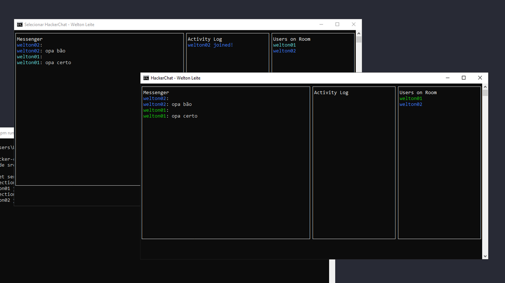

<h1  align="center">HACKER-CHAT</h1>

  

<p  align="center">
<a  href="#-technologies">Technologies</a>&nbsp;&nbsp;&nbsp;|&nbsp;&nbsp;&nbsp;
<a  href="#-project">Project</a>&nbsp;&nbsp;&nbsp;|&nbsp;&nbsp;&nbsp;
<a  href="#-how-to-run">How to run</a>&nbsp;&nbsp;&nbsp;|&nbsp;&nbsp;&nbsp;
<a  href="#-licence">Licence</a>
</p>

  

<p  align="center">
 
</p>

 
  

## ✨ Technologies

  

This project was developed with the following technologies:

  

#### **Client** ([NodeJS](https://nodejs.org/en/))

- **[Blessed](https://www.npmjs.com/package/blessed)**


#### **Server** ([NodeJS](https://nodejs.org/en/))

- **[Nodemon](https://nodemon.io/)**


#### **Utilities**

- Editor: **[Visual Studio Code](https://code.visualstudio.com/)**


  

## 💻 Project

  
HACKER-CHAT is part of "JSExpert Week #03" by Erick Wendel. A chat in the terminal where it is possible to chat with other people in real time through websockets, all done using native Node.js modules (with the exception of the interface, in which blessed was used).

  

  

## 🚀 How to run

  

#### Server

```bash

# Clone this repo
$ git clone https://github.com/wwwwelton/semana-js-expert30.git

# Go to the project folder
$ cd hacker-chat

# Move to server folder
$ cd server

# Install the dependencies
$ npm install

# Run the server
$ npm run start

# The server will start at http://localhost:9898

```

#### Client

```bash

# Clone this repo
$ git clone https://github.com/wwwwelton/semana-js-expert30.git

# Go to the project folder
$ cd hacker-chat

# Move to client folder
$ cd client

# Install the dependencies
$ npm install

# Run the application for the first user
$ npm run user01

# Run the application for the second user
$ npm run user02

# The application will run on the terminal

# The command to manually enter the username, password and connection
# is in the package.json of the client folder

```

  

  

## 📄 Licence

  

This project is licensed under the GNU General Public License v3.0 - see the [LICENSE](LICENSE) file for details.

  

---

  

Made by Welton Leite 👋 [See my linkedin](https://www.linkedin.com/in/welton-leite-b3492985/)
